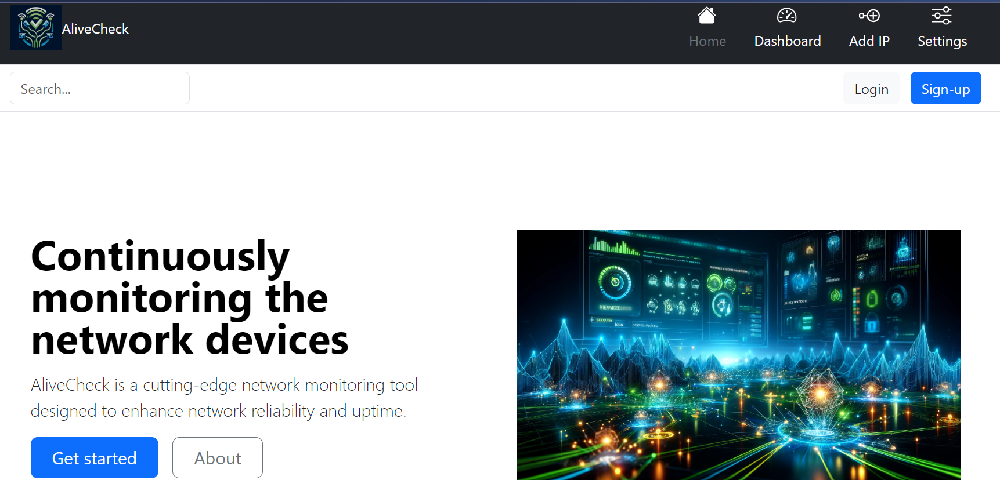
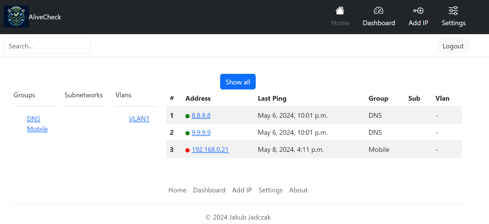
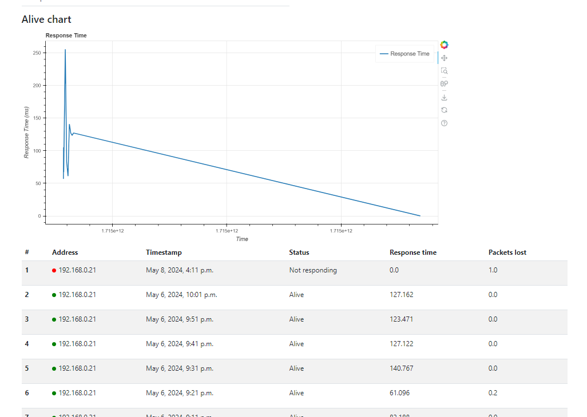

<h1>Alive Check Application</h1>

The application allows users to easily manage and control the infrastructure

> #### Technology stack!
>
> - Web framework: Django 5.0 (with Python 3.12)
> - Database: PostgreSQL
> - Containerization: Docker (with docker-compose)
> - Asynchronous Task Queue: Celery
> - Message Broker: RabbitMQ
> - Development and Deployment: Github Actions

